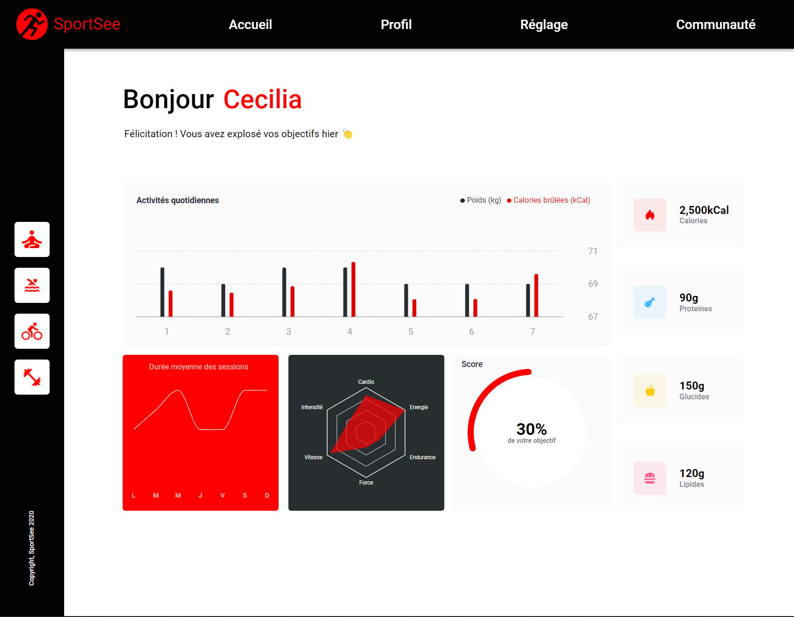

# SportSee

SportSee is a React project where the goal is to create a dashboard for a nutrition and sports monitoring web application using data from an API.

## Prerequisites

- [NodeJS](https://nodejs.org/en/)
- [npm](https://www.npmjs.com/)

## Technologies

This project is developed with:

- [React 17.0.2](https://fr.reactjs.org/)
- [React Router 6.3.0](https://reactrouter.com/)
- [Recharts 2.1.9](https://recharts.org/en-US/)
- [Proptypes 15.8.1](https://www.npmjs.com/package/prop-types)

> 23/05/2022: The application currently use React version 17.0.2 due to a conflict with Recharts v2.1.9

## Installation

Clone the repository

```sh
git clone https://github.com/leolegrand/sportsee
```

Install the dependencies/npm packages

```sh
npm install
```

Run the project

```sh
npm start
```

> By default the server is hosted on http://localhost:3000

## Back-end / API

https://github.com/OpenClassrooms-Student-Center/P9-front-end-dashboard

> for more information about the configuration and instalation of the back-end, please refer to the back-end README
